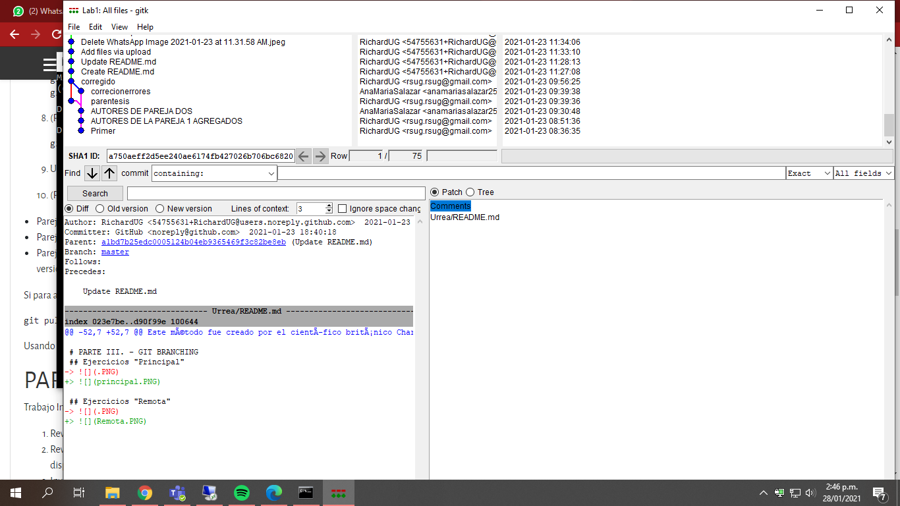

# LABORATORIO 1 - INTRODUCCIÓN GIT - 2021-1

# PARTE I. - CREANDO REPOSITORIOS

## ¿Las dos parejas lo pudieron hacer?, ¿Qué quedó al final en la versión oficial?
> No lo pudimos hacer al tiempo, solamente admitio la versión de Ana Maria, al final quedo el commit hecho por ella

## Usando el comando gitk, ¿Qué diferencia hay ahora en el historial de cambios en el repositorio?
> creo un segundo commit al mismo nivel del de Ana Maria y despues lo creo un commit mas bajo uniendo la información de ambos
>
> 

