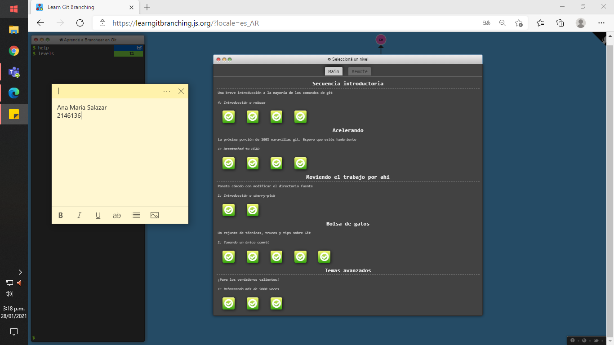
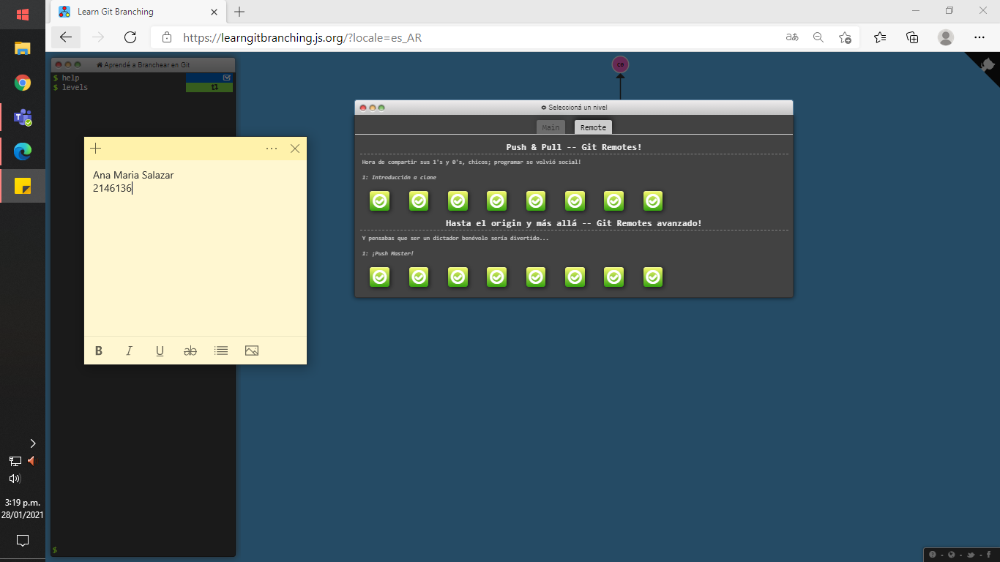

# PARTE II. - INTRODUCCIÓN GENERAL GIT
## _Datos personales:_
>* **Nombre:**  Ana María Salazar Bohórquez
>* **Edad:** 20 años
>* **Fecha de nacimiento:** 25/07/2020
>* **RH:** A+
>
> 

## _Mi top 3 de comidas favoritas:_
> 1. Pasta
>
> 
>
> 2. Salchipapa
>
> 
>
> 3. Pollo Broaster 
>
> 

## _Sobre la universidad:_
> **Semestre:** Octavo 
>
> **Pensum actual:**
>> 1. CVDS
>> 2. ACSO
>> 3. AUPN
>> 4. SPIM
>> 5. ALM1
>> 5. FCFI

## InsertionSort
 > La clasificación por inserción es un algoritmo de clasificación simple que funciona de manera similar a la forma en que clasifica las cartas de juego en sus manos. La matriz se divide virtualmente en una parte ordenada y otra sin clasificar. Los valores de la parte sin clasificar se seleccionan y colocan en la posición correcta en la parte clasificada.
 
>>>>>> **Algoritmo**
>>Para ordenar una matriz de tamaño n en orden ascendente:
>>1. Itere de arr [1] a arr [n] sobre la matriz.
>>2. Compare el elemento actual (clave) con su predecesor.
>>3. Si el elemento clave es más pequeño que su predecesor, compárelo con los elementos anteriores. Mueva los elementos mayores una posición hacia arriba para dejar espacio para el elemento intercambiado.
 
 > **Informaciòn de:** <https://www.geeksforgeeks.org/insertion-sort/>

>> **Implementaciòn en Python** 
~~~
from sys import stdin
def insertionSort(alist):

    for index in range(1,len(alist)):
        currentvalue = alist[index]
        position = index

        while position>0 and alist[position-1]>currentvalue:
            alist[position]=alist[position-1]
            position = position-1

        alist[position]=currentvalue

    return alist
def main():
    lis=[int(x) for x in stdin.readline().strip().split()]
    print(insertionSort(lis))
main()

~~~

# PARTE III. - GIT BRANCHING
## Ejercicios "Principal"
> 

## Ejercicios "Remota"
> 
