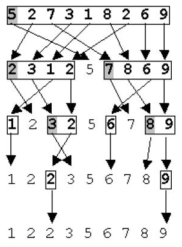
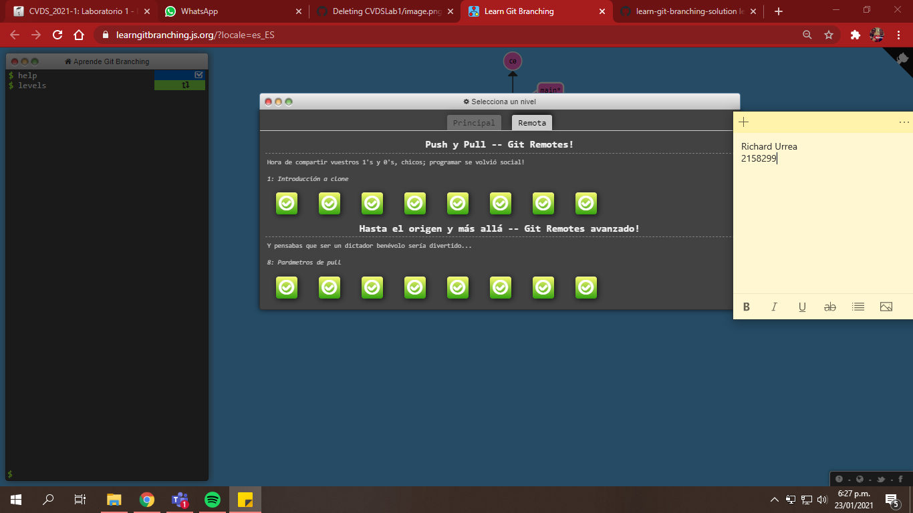

# PARTE II. - INTRODUCCIÓN GENERAL GIT
## _Información personal_
> * Richard Santiago Urrea Garcia
> * 19 años
> * estudiante de ingeniera de sistemas
>
> 

## _Información del semestre_
> **Semestre actual:**
>> * Octavo 
>
> **Pensum actual:**
>> * CVDS
>> * AUPN
>> * RECO
>> * EGI3
>> * PRYE

## Quick Sort
> El método Quick Sort es actualmente el mas eficiente y veloz de los método de ordenación interna. Es tambien conocido con el nombre del método rápido y de ordenamento por partición.\
Este método es una mejora sustancial del método de intercambio directo y recibe el nombre de Quick Sort, por la velocidad con la que ordena los elementos del arreglo.
Quicksort es un algoritmo basado en la técnica de divide y vencerás, que permite, en promedio, ordenar n elementos en un tiempo proporcional a n log n.\
Quicksort es actualmente el más eficiente y veloz de los métodos de ordenación interna.\
Este método fue creado por el científico británico Charles Antony Richard Hoare, tambien conocido como Tony Hoare en 1960, su algoritmo Quicksort es el algoritmo de ordenamiento más ampliamente utilizado en el mundo.
>
> información obtenida de <http://cidecame.uaeh.edu.mx/lcc/mapa/PROYECTO/libro9/mtodo_quick_sort.html>
>
> Ejemplo:
>> 
>
## IMPLEMENTACION EN PYTHON
~~~
    def quicksort (x):
        if len(x)==1 or len(x)==0:
            return x
        else:
            pivote=x[0]
            i=0
            for j in range(len(x)-1):
                if x[j+1]<pivote:
                    x[j+1],x[i+1]=x[i+1],x[j+1]
                    i+=1
            x[0],x[i]=x[i],x[0]
            first_part=quicksort(x[:i])
            second_part=quicksort (x[i+1:])
            first_part.append(x[i])
        print(x)
    alist = [ 54 , 26 , 93 , 17 , 77 , 31 , 44 , 55 , 20 ]
    print(quicksort(alist))
~~~

# PARTE III. - GIT BRANCHING
## Ejercicios "Principal"
> 

## Ejercicios "Remota"
> 
